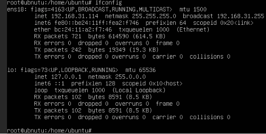
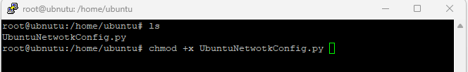
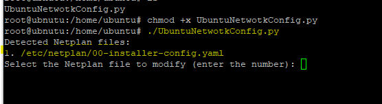
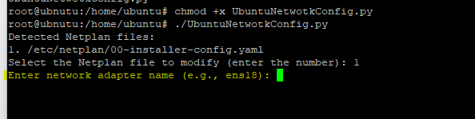
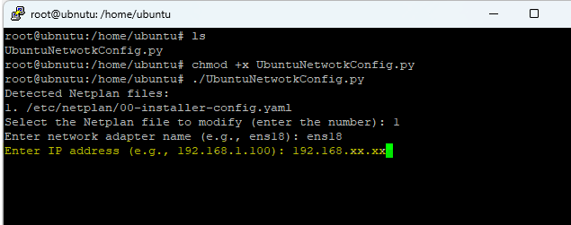
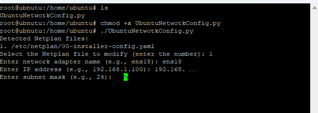
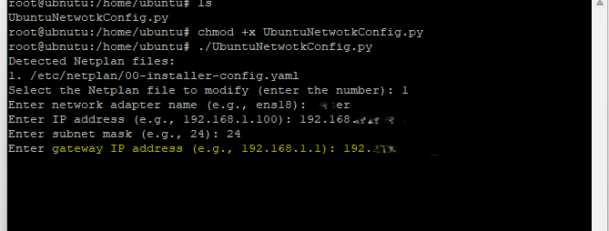
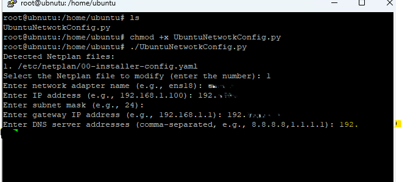
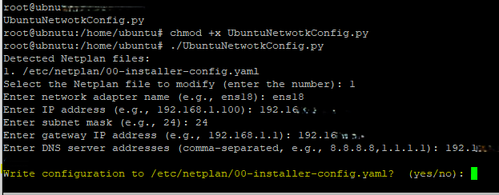
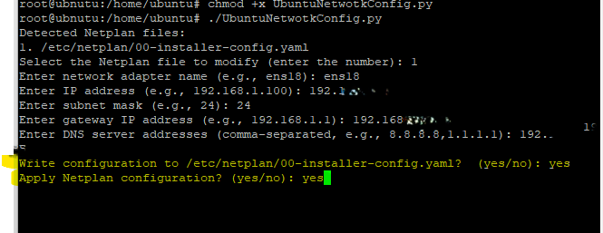

# UbuntuNetworkConfig
Script use to change network configuration in ubuntu

Screenshots below shocasing the steps to use this script
Please note its only for the Ubunutu servers. 

Ignore the warning and its simply done you can now connect to your machine with new IP. 
